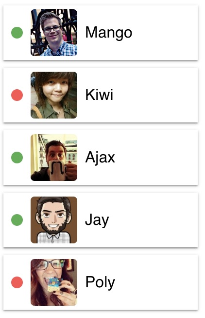

**Читать на других языках: [Русский](README.md), [Українська](README.ua.md).**

# Список друзів

Необхідно створити компонент `<FriendList>`, за допомогою якого ми могли б
відображати інформацію про друзів користувача. Інформація про друзів
зберігається в файлі [friends.json](./friends.json).



## Опис компонента FriendList

Компонент повинен приймати один проп `friends` - масив об'єктів друзів.

Компонент повинен створювати DOM наступної структури.

```html
<ul class="friend-list">
  <!-- Довільна кількість FriendListItem, в залежності від кількості об'єктів в масиві -->
</ul>
```

## Опис компонента FriendListItem

Компонент повинен приймати кілька пропів:

- `avatar` - посилання на аватар
- `name` - ім'я друга
- `isOnline` - буль, який сигналізує про стан друга, в мережі чи ні.

Залежно від пропа `isOnline`, повинен змінюватися колір фону `span.status`. Це
можна зробити через різний CSS-клас або Styled Components.

Компонент повинен створювати DOM наступної структури.

```html
<li class="item">
  <span class="status"></span>
  
  <p class="name"></p>
</li>
```

## Приклад використання

```js
import friends from 'path/to/friends.json';

<FriendList friends={friends} />;
```
