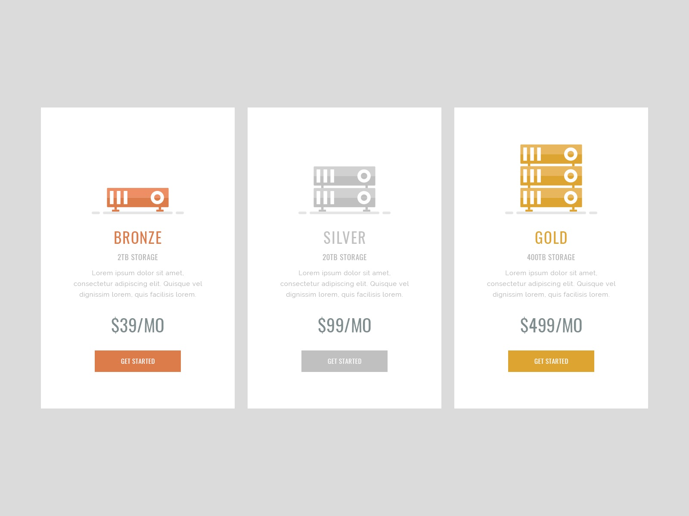

# Тарифный план

Необходимо создать компоненты, с помощью которых мы могли бы отображать
информацию о тарифном плане на услуги компании.



Информация о тарифных планах хранится в файле [pricing-plan.json](./pricing-plan.json).

- `PricingItem` - создает разметку одного элемента тарифного плана
- `PricingPlan` - создает разметку всего списка тарифного плана и использует
  `PricingItem`

## Описание компонента PricingItem

Компонент должен принимать несколько пропов:

- `label` - название плана
- `icon` - url иконки
- `capacity` - размер хранилища
- `price` - цена за один месяц
- `description` - описание плана

Компонент должен создавать DOM следующей структуры.

```html
<div class="pricing-item">
  <i class="icon"></i>
  <h2 class="label">Bronze</h2>
  <p class="capacity">2TB Storage</p>
  <p class="description">
    Lorem ipsum dolor sit amet consectetur adipisicing elit. Unde explicabo
    quidem iste! Neque, tempore provident? Minus deleniti quia aspernatur, dolor
    id enim eos nostrum repellendus quas provident minima ad blanditiis!
  </p>
  <p class="price">$39/MO</p>
  <button class="button">Get Started</button>
</div>
```

## Описание компонента PricingPlan

Компонент должен принимать проп `items`, массив объектов с тарифными планами.

Компонент должен создавать DOM следующей структуры.

```html
<ul class="pricing-plan">
  <li class="item">
    <!-- разметка из PricingItem -->
  </li>
  <!--
    Произвольное кол-во li внутри которых разметка из PricingItem,
    в зависимости от кол-ва объектов в массиве
  -->
</ul>
```

## Пример использования

```js
import pricingPlanItems from 'path/to/pricing-plan.json';

ReactDOM.render(
  <PricingPlan items={pricingPlanItems} />,
  document.getElementById('root'),
);
```
