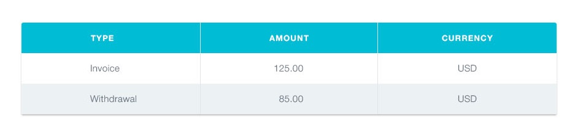

# История транзакций

Необходимо создать компонент истории транзакций в личном кабинете интернет
банка.



Данные для списка доступны в формате JSON в файле
[transactions.json](./transactions.json). Это массив объектов, каждый объект
описывает одну транзакцию со следующими свойствами:

- `id` — уникальный идентификатор транзакции
- `type` — тип транзакции
- `amount` - сумма транзакции
- `currency` - тип валюты

## Описание компонента

Необходимо создать компонент `<TransactionHistory>` принимающий один проп
`items` - массив объектов транзакций из `transactions.json`. Компонент создает
разметку таблицы. Каждая транзакция это строка таблицы, для примера указана
разметка двух транзакций.

```html
<table class="transaction-history">
  <thead>
    <tr>
      <th>Type</th>
      <th>Amount</th>
      <th>Currency</th>
    </tr>
  </thead>

  <tbody>
    <tr>
      <td>Invoice</td>
      <td>125</td>
      <td>USD</td>
    </tr>
    <tr>
      <td>Withdrawal</td>
      <td>85</td>
      <td>USD</td>
    </tr>
  </tbody>
</table>
```

## Пример использования

```js
import transactions from 'path/to/transactions.json';

ReactDOM.render(
  <TransactionHistory items={transactions} />,
  document.getElementById('root'),
);
```
