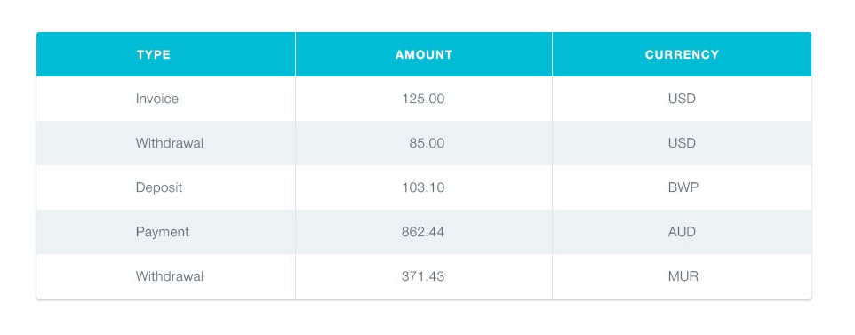

**Читать на других языках: [Русский](README.md), [Українська](README.ua.md).**

# Історія транзакцій

Необхідно створити компонент історії транзакцій в особистому кабінеті інтернет
банку.



Дані для списку доступні в форматі JSON в файлі
[transactions.json](./transactions.json). Це масив об'єктів, кожен об'єкт описує
одну транзакцію з наступними властивостями:

- `id` — унікальний ідентифікатор транзакції
- `type` — тип транзакції
- `amount` - сума транзакції
- `currency` - тип валюти

## Опис компонента

Необхідно створити компонент `<TransactionHistory>`, який приймає один проп
`items` - масив об'єктів транзакцій з `transactions.json`. компонент створює
розмітку таблиці. Кожна транзакція це рядок таблиці, для прикладу вказана
розмітка двох транзакцій.

```html
<table class="transaction-history">
  <thead>
    <tr>
      <th>Type</th>
      <th>Amount</th>
      <th>Currency</th>
    </tr>
  </thead>

  <tbody>
    <tr>
      <td>Invoice</td>
      <td>125</td>
      <td>USD</td>
    </tr>
    <tr>
      <td>Withdrawal</td>
      <td>85</td>
      <td>USD</td>
    </tr>
  </tbody>
</table>
```

## Приклад використання

```js
import transactions from 'path/to/transactions.json';

ReactDOM.render(
  <TransactionHistory items={transactions} />,
  document.getElementById('root'),
);
```
