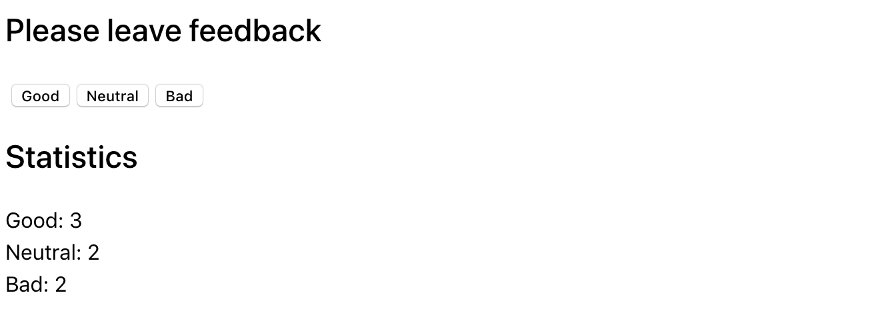
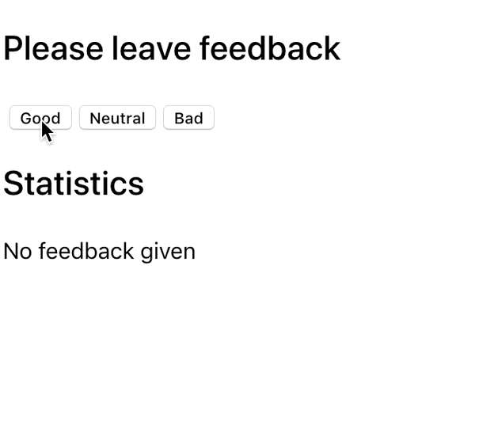

**Читать на других языках: [Русский](README.md), [Українська](README.ua.md).**

# Виджет отзывов

Как и большинство компаний, кафе Expresso собирает отзывы от своих клиентов.
Твоя задача - создать приложение для сбора статистики. Есть всего три варианта
обратной связи: хорошо, нейтрально и плохо.

## Шаг 1

Приложение должно отображать количество собранных отзывов для каждой категории.
Приложение не должно сохранять статистику отзывов между разными сессиями
(обновление страницы).

Состояние приложения обязательно должно быть следующего вида, добавлять новые
свойства нельзя.

```bash
state = {
  good: 0,
  neutral: 0,
  bad: 0
}
```

Интерфейс может выглядеть так.



## Шаг 2

Расширь функционал приложения так, чтобы в интерфейсе отображалось больше
статистики о собранных отзывах. Добавь отображение общего количества собранных
отзывов из всех категорий и процент положительных отзывов. Для этого создай
вспомогательные методы `countTotalFeedback()` и
`countPositiveFeedbackPercentage()`, подсчитывающие эти значения основываясь на
данных в состоянии (вычисляемые данные).


## Шаг 3

Выполни рефакторинг приложения. Состояние приложения должно оставаться в
корневом компоненте `<App>`.

- Вынеси отображение статистики в отдельный компонент
  `<Statistics good={} neutral={} bad={} total={} positivePercentage={}>`.
- Вынеси блок кнопок в компонент
  `<FeedbackOptions options={} onLeaveFeedback={}>`.
- Создай компонент `<Section title="">`, который рендерит секцию с заголовком и
  детей (children). Оберни каждый из `<Statistics>` и `<FeedbackOptions>` в
  созданный компонент секции.

## Шаг 4

Расширь функционал приложения так, чтобы блок статистики рендерился только после
того, как был собран хотя бы один отзыв. Сообщение об отсутствиии статистики
вынеси в компонент `<Notification message="There is no feedback">`.


