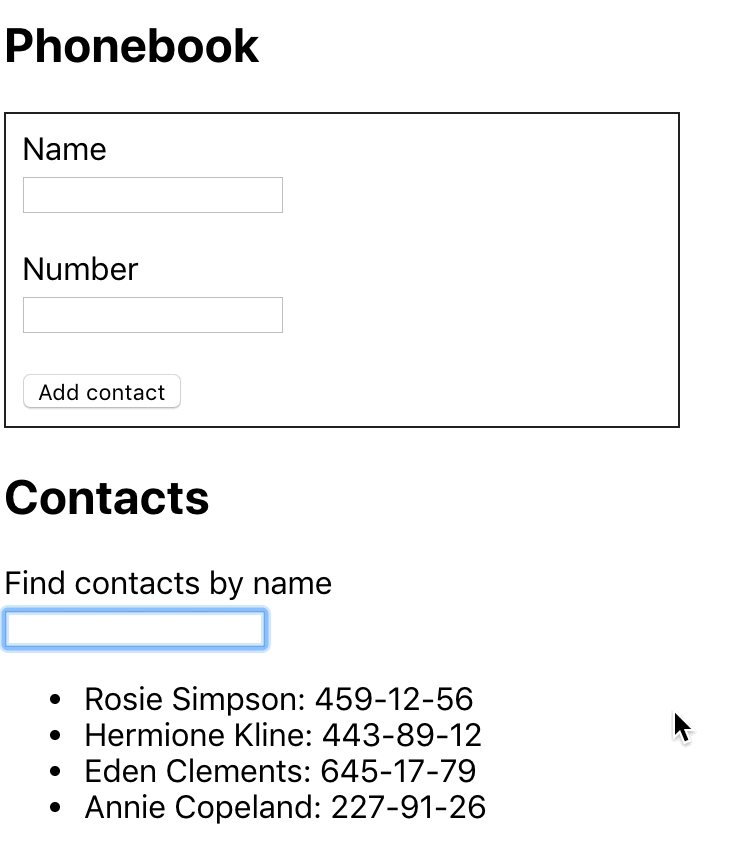
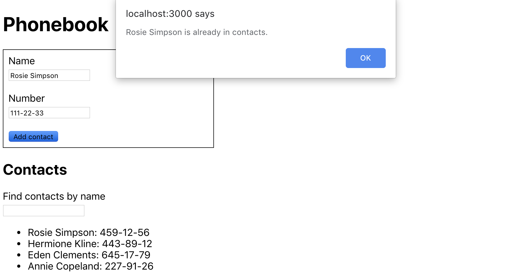

**Читать на других языках: [Русский](README.md), [Українська](README.ua.md).**

# Телефонная книга

Напиши приложение хранения контактов телефонной книги.

## Шаг 1

Приложение должно состоять из формы и списка контактов. На текущем шаге реализуй
добавление имени контакта и отображение списка контактов. Приложение не должно
сохранять контакты между разными сессиями (обновление страницы).

Состояние хранящееся в родительском компоненте `<App>` обязательно должно быть
следующего вида, добавлять новые свойства нельзя.

```bash
state = {
  contacts: [],
  name: ''
}
```

Каждый контакт должен быть объектом со свойствами `name` и `id`. Для генерации
идентификаторов используй любой подходящий пакет, например
[uuid](https://www.npmjs.com/package/uuid#version-4). После завершения этого
шага, приложение должно выглядеть примерно так.


## Шаг 2

Расширь функционал приложения, позволив пользователям добавлять номера
телефонов. Для этого добавь второй инпут в форму, и свойство для хранения его
значения в состоянии.

```bash
state = {
  contacts: [],
  name: '',
  number: ''
}
```

После завершения этого шага, приложение должно выглядеть примерно так.


## Шаг 3

Добавь поле поиска, которое можно использовать для фильтрации списка контактов
по имени.

- Поле поиска это инпут без формы, значение которого записывается в состояние
  (контролируемый элемент).
- Логика фильтрации должна быть нечувствительна к регистру.

```bash
state = {
  contacts: [],
  filter: '',
  name: '',
  number: ''
}
```



Когда мы работаем над новым функционалом, бывает удобно жестко закодировать
некоторые данные в состояние. Это избавит от необходимости вручную вводить
данные в интерфейсе для тестирования работы нового функционала. Например можно
использовать такое начальное состояние.

```bash
state = {
  contacts: [
    {id: 'id-1', name: 'Rosie Simpson', number: '459-12-56'},
    {id: 'id-2', name: 'Hermione Kline', number: '443-89-12'},
    {id: 'id-3', name: 'Eden Clements', number: '645-17-79'},
    {id: 'id-4', name: 'Annie Copeland', number: '227-91-26'},
  ],
  filter: '',
  name: '',
  number: ''
}
```

## Шаг 4

Если твое приложение реализовано в одном компоненте `<App>`, выполни
рефакторинг, выделив подходящие части в отдельные компоненты. В состоянии
корневого компонента `<App>` останутся только свойства `contacts` и `filter`.

```bash
state = {
  contacts: [],
  filter: ''
}
```

Достаточно выделить четыре компонента: форма добавления контактов, список
контактов, элемент списка контактов и фильтр поиска.

После рефакторинга корневой компонент приложения будет выглядеть так.

```html
<div>
  <h1>Phonebook</h1>
  <ContactForm ... />

  <h2>Contacts</h2>
  <Filter ... />
  <ContactList ... />
</div>
```

## Шаг 5

Запрети пользователю возможность добавлять контакты, имена которых уже есть в
телефонной книге. При попытке выполнить такое действие выведи `alert` с
предупреждением.



## Шаг 6

Расширь функционал приложения, позволив пользователю удалять ранее сохраненные
контакты.


