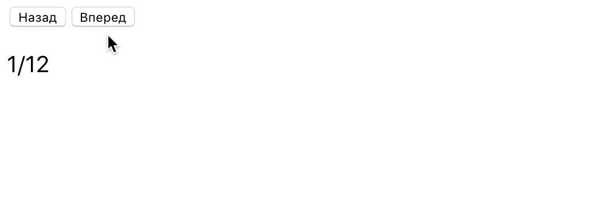

# Читатель публикаций

Создай читатель публикаций для просмотра контента с возможностью перейти к
следующей либо предыдущей публикации, а так же отображением прогресса.


Приложение должено создавать DOM-элемент следующей структуры.

```html
<!-- Разметка компонента <Reader> -->
<div>
  <!-- Разметка компонента <Controls> -->
  <section>
    <button type="button">Назад</button>
    <button type="button">Вперед</button>
  </section>

  <!-- Разметка компонента <Progress> -->
  <p>1/10</p>

  <!-- Разметка компонента <Publication> -->
  <article>
    <h2>Lorem ipsum dolor sit amet</h2>
    <p>
      Lorem ipsum dolor sit amet consectetur adipisicing elit. Temporibus,
      molestiae dolore ipsa sed similique necessitatibus. Aut qui porro
      quibusdam esse libero est eius, repellendus unde nihil, sequi voluptate
      eaque officiis aliquam impedit laborum adipisci cumque sit.
    </p>
  </article>
</div>
```

## Шаг 1

На текущем шаге создай компонент `<Reader items={}>` с секцией кнопок для
изменения индекса публикации в состоянии и блок отображения прогресса. Состояние
хранящееся в родительском компоненте обязательно должно быть следующего вида,
добавлять новые свойства нельзя.

```bash
state = {
  publicationIndex: 0
}
```

Публикации для передачи в проп `items` компонента `<Reader>` хранятся в файле
[publications.json](./publications.json). После завершения этого шага,
приложение должно выглядеть примерно так.



## Шаг 2

Добавь отображение текущей публикации из пропа `items` компонента `<Reader>`. В
случае когда необходимо показывать только один определенный элемент коллекции, в
React не нужно рендерить разметку всей коллекции сразу и показывать только один
нужный элемент скрывая все остальные. Вместо этого необходимо рендерить только
тот элемент, который необходимо показать в данный момент. Для этого, в методе
`render()` получи и рендери разметку нужной публикации используя массив из
пропса `items` и текущий индекс публикации из состояния. Так при изменении
индекса в состоянии, каждый раз будет рендерится только необходимая публикация.

```js
// Получаем объект публикации в методе render() компонента <Reader>
const publication = this.props.items[this.state.publicationIndex];
```

После завершения этого шага, приложение должно выглядеть так.


## Шаг 3

Если твое приложение реализовано в одном компоненте `<Reader>`, выполни
рефакторинг, выделив подходящие части в отдельные компоненты.

Достаточно выделить три компонента.

- `<Controls onPrevClick={} onNextClick={}>` - секция кнопок для листания
  публикаций.
- `<Progress currentPage={} totalPages={}>` - блок отображения прогресса.
- `<Publication title={} text={}>` - статья с разметкой одной публикации.

После рефакторинга, корневой компонент `<Reader>` будет выглядеть так.

```html
<>
  <Controls ... />
  <Progress ... />
  <Publication ... />
</>
```

## Шаг 4

Запрети пользователю пролистывать публикации за граничные значения, сделав
кнопки пролистывания не активными (атрибут disabled) в момент достижения
соотвествующей границы. То есть меньше `1` и больше общего количества публикаций
в пропсе `items` компонента `<Reader>`. Для этого передавай в компонент
`<Controls>` еще два пропа `prevBtnDisabled={}` и `nextBtnDisabled={}`. Значения
для пропсов вычисляй в методе `render()` компонента `<Reader>`.


## Пример использования

```js
import publications from 'path/to/publications.json';

ReactDOM.render(
  <Reader items={publications} />,
  document.getElementById('root'),
);
```
