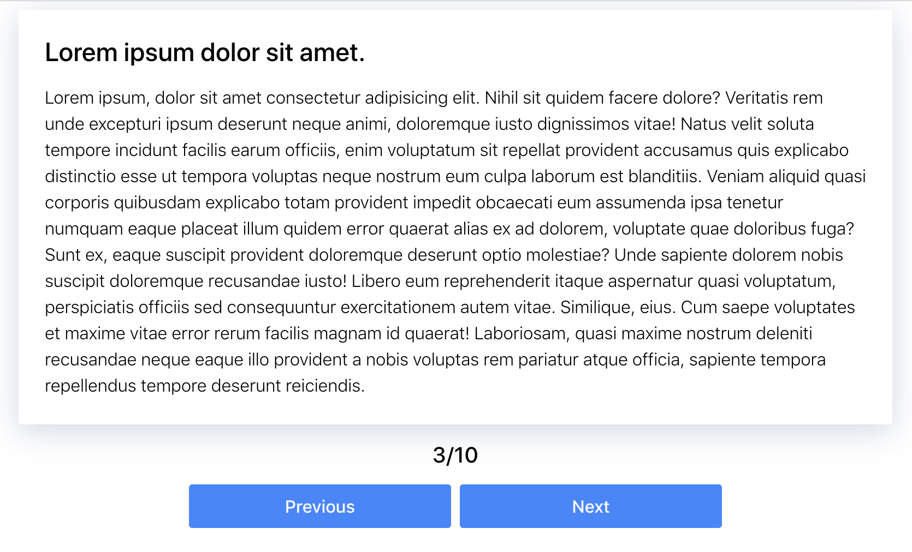

# Читатель публикаций

Необходимо создать гаджет читателя публикаций для просмотра контента с
возможностью перейти к следующей либо предыдущей публикации, а так же
отображением текущего порядкового номера просматриваемой публикации.



Список публикаций хранится в файле [publications.json](./publications.json).

Необходимо создать компоненты `Reader`, `Publication`, `Counter` и `Controls` c
необходимыми пропами и состоянием.

## Описание компонента Reader

Корневой компонент, родитель для остальных, хранит состояние приложения - индекс
текущей публикации. Должен иметь один проп `items` - массив объектов публикаций
следующего формата.

- `id` — уникальный идентификатор публикации
- `title` — заголовок
- `text` — текстовый контент

Результирующий гаджет должен создавать DOM-элемент следующей структуры.

```html
<div class="reader">
  <!-- Разметка компонента <Controls> -->
  <section class="controls">
    <button type="button" class="button">Назад</button>
    <button type="button" class="button">Вперед</button>
  </section>

  <!-- Разметка компонента <Counter> -->
  <p class="counter">3/10</p>

  <!-- Разметка компонента <Publication> -->
  <article class="publication">
    <h2>3. Lorem ipsum dolor sit amet</h2>
    <p>
      Lorem ipsum dolor sit amet consectetur adipisicing elit. Temporibus,
      molestiae dolore ipsa sed similique necessitatibus. Aut qui porro
      quibusdam esse libero est eius, repellendus unde nihil, sequi voluptate
      eaque officiis aliquam impedit laborum adipisci cumque sit.
    </p>
  </article>
</div>
```

Возьми готовые стили из файла [styles.css](./styles.css) и подкорректируй их под
`CSS-модули` или `Styled Components`.

## Пример использования

```js
import publications from 'path/to/publications.json';

ReactDOM.render(
  <Reader items={publications} />,
  document.getElementById('root'),
);
```
