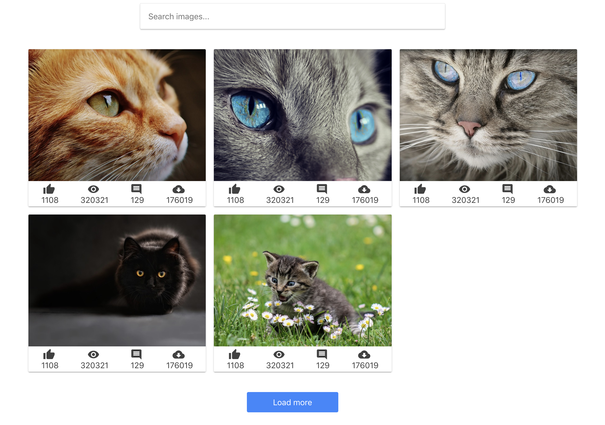

**Читати іншими мовами: [Русский](README.md), [Українська](README.ua.md).**

# Пошук зображень

Напиши застосунок пошуку зображень за ключовим словом. Прев'ю робочого застосунку [дивись за посиланням](https://drive.google.com/file/d/1oXCGyiq4uKwW0zzraZLKk4lh3voBlBzZ/view?usp=sharing).

Створи компоненти `<Searchbar>`, `<ImageGallery>`, `<ImageGalleryItem>`,
`<Loader>`, `<Button>` і `<Modal>`. Готові стилі компонентів можна взяти у файлі [styles.css](./styles.css) і підправити під себе, якщо потрібно.



## Інструкція Pixabay API

Для HTTP-запитів використовуй публічний сервіс пошуку зображень [Pixabay](https://pixabay.com/api/docs/). Зареєструйся та отримай приватний ключ доступу.

URL-рядок HTTP-запиту.

```bash
https://pixabay.com/api/?q=cat&page=1&key=your_key&image_type=photo&orientation=horizontal&per_page=12
```

Pixabay API підтримує пагінацію, за замовчуванням параметр `page` дорівнює `1`. Нехай у відповіді надходить по 12 об'єктів, встановлено в параметрі `per_page`. Не забудь, що під час пошуку за новим ключовим словом, необхідно скидати значення `page` до `1`.

У відповіді від апі приходить масив об'єктів, в яких тобі цікаві лише наступні властивості.

- `id` – унікальний ідентифікатор
- `webformatURL` – посилання на маленьке зображення для списку карток
- `largeImageURL` – посилання на велике зображення для модального вікна

## Опис компонента `<Searchbar>`

Компонент приймає один проп `onSubmit` – функцію для передачі значення інпута під час сабміту форми. Створює DOM-елемент наступної структури.

```html
<header class="searchbar">
  <form class="form">
    <button type="submit" class="button">
      <span class="button-label">Search</span>
    </button>

    <input
      class="input"
      type="text"
      autocomplete="off"
      autofocus
      placeholder="Search images and photos"
    />
  </form>
</header>
```

## Опис компонента `<ImageGallery>`

Список карток зображень. Створює DOM-елемент наступної структури.

```html
<ul class="gallery">
  <!-- Набір <li> із зображеннями -->
</ul>
```

## Опис компонента `<ImageGalleryItem>`

Компонент елемента списку із зображенням. Створює DOM-елемент наступної структури.

```html
<li class="gallery-item">
  
</li>
```

## Опис компонента `<Button>`

При натисканні на кнопку `Load more` повинна довантажуватись наступна порція зображень і рендеритися разом із попередніми. Кнопка повинна рендеритися лише тоді, коли є якісь завантажені зображення. Якщо масив зображень порожній, кнопка не рендериться.

## Опис компонента `<Loader>`

Компонент спінера відображається, доки відбувається завантаження зображень. Використовуйте будь-який готовий компонент, наприклад [react-loader-spinner](https://github.com/mhnpd/react-loader-spinner) або будь-який інший.

## Опис компонента `<Modal>`

Під час кліку на елемент галереї повинно відкриватися модальне вікно з темним оверлеєм і відображатися велика версія зображення. Модальне вікно повинно закриватися по натисканню клавіші `ESC` або по кліку на оверлеї.

Зовнішній вигляд схожий на функціонал цього [VanillaJS-плагіна](https://basiclightbox.electerious.com/), тільки замість білого модального вікна рендериться зображення (у прикладі натисніть `Run`). Анімацію робити не потрібно!

```html
<div class="overlay">
  <div class="modal">
    
  </div>
</div>
```
