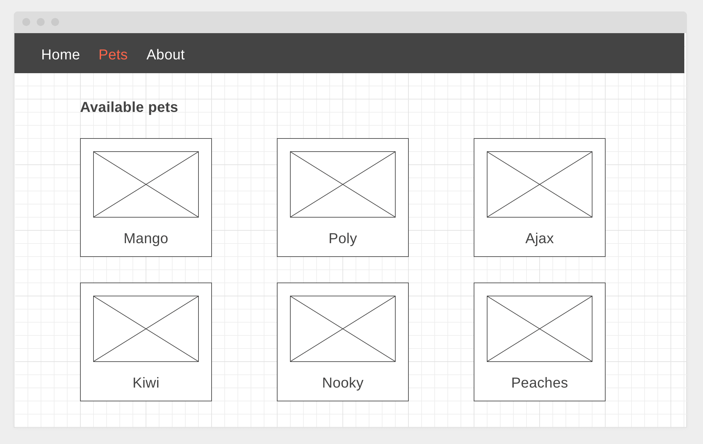

# Магазин питомцев

Напиши приложение интернет-магазина по продаже питомцев. Данные питомцев возьми
в файле [pets.json](./pets.json). Макеты страниц лежат в папке
[mockup](./mockup).

В приложении должны быть следующие маршруты:

- '/' - компонент `HomePage`, приветственная страница магазина
- '/about' - компонент `AboutPage`, страница с информацией о магазине
- '/pets' - компонент `PetsPage`, страница со списком всех питомцев
- 'pets/:id' - компонент `PetPage`, страница с детальной информацией о питомце

Если пользователь зашел по несуществующему маршруту, его необходимо
перенаправлять на домашнюю страницу.
