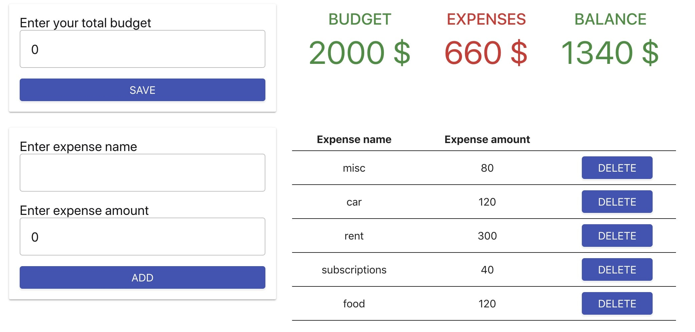

# Планировщик бюджета

Один из твоих коллег написал приложение планировщика бюджета на чистом React.
Тебе поступила задача добавить библиотеку Redux и перенести управление
состоянием в нее, таким образом разделив логику от компонентов.

Файлы компонентов рабочего проекта возьми
[в песочниче по ссылке](https://codesandbox.io/embed/budget-planer-app-homework-3-yhf4g?fontsize=14).

- Вынеси состояние вне копонентов
- Создай хранилще, действия, редюсеры и т. п.
- Добавь контейнеры для компонентов подписывающихся на состояние

