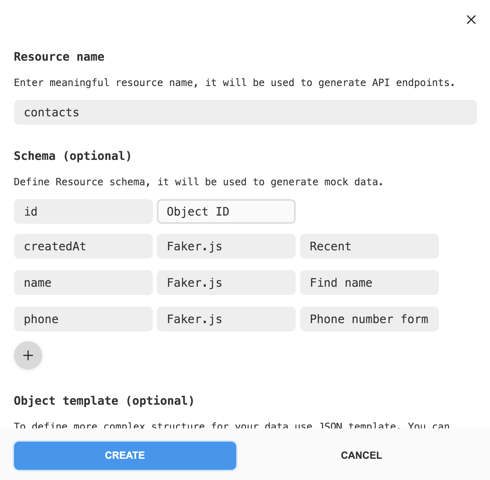

**Читати іншими мовами: [Русский](README.md), [Українська](README.ua.md).**

Використовуй цей
[шаблон React-проекту](https://github.com/goitacademy/react-homework-template#readme)
як стартову точку своєї програми.

# Критерії приймання

- Створений репозиторій `goit-react-hw-07-phonebook`
- Використана бібліотека `Redux Toolkit`

## Телефонна книга

Виконай рефакторинг коду застосунку «Телефонна книга». Видали код, який
відповідає за зберігання та читання контактів з локального сховища, та додай
роботу з бекендом для зберігання контактів.

Створи бекенд для розробки за допомогою UI-сервісу
[mockapi.io](https://mockapi.io). Зареєструйся, використовуючи свій обліковий
запис GitHub.

Створи ресурс `contacts`, щоб отримати ендпоінт `/contacts`. Використовуй
конструктор ресурсу та опиши об'єкт контакту як на ілюстрації.

Використовуй функцію
[createAsyncThunk](https://redux-toolkit.js.org/api/createAsyncThunk) або
[RTK Query](https://redux-toolkit.js.org/rtk-query/overview) для взаємодії з
бекендом та асинхронними запитами.
